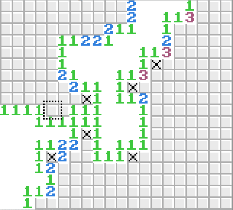
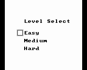

## Minesweeper *For the Gameboy*

|  | |
| --- | --- |

Built mostly ground up in assembly, my take on the classic game of minesweeper.
I followed the excellent ["hello world" examples](http://cratel.wichita.edu/cratel/ECE238Spr08) by Witchita State University. These begin with displaying a set of tiles on the Gameboy's screen and include moving a character on the screen and working with noise / music. They also include an introduction (by example) of RGBDS's asm and macro syntax.

### Play minesweepGB

To play minesweepGB, simply load the play_minesweep.gb file with your [favorite emulator](http://bgb.bircd.org/)

### Compile minesweepGB

To compile, run these commands (linux):
```
rgbasm -o play_minesweep.obj minesweepGB.asm
rgblink -o play_minesweep.gb play_minesweep.obj
rgbfix -v -p0 play_minesweep.gb
rm play_minesweep.obj
```


## Features

#### Macros

Freakin' awesome macros. I've seen it said that RGBDS has amazing macro support. And it's true, but its syntax is very terse. Minesweep contains some powerful macros that make reading assembly MUCH easier. Check out [syntax.asm](syntax.asm)  to see some excellent macros that make readable assembly. My Favorite: IFA
```
ifa	<, 32,	ld a, 32
```
Which can be read as "if A < 32, load A with 32"

IFA is used (in this case) to run this psuedo-code: 
```a = max(a, 32)```.
In assembly, the above macro expands to:
```
cp	32
jr	nc, .skip
ld	a, 32
.skip
```
[A nice, short article on writing readable assembly through macros](http://www.drdobbs.com/parallel/assembly-language-macros/184408512)
#### Responsive, silky-smooth gameplay

Minesweep uses hardware interrupts and careful state management to number crunch and reveal areas on the minefield without sacrificing player-input response time. The effect is split-second minefield reveal with no lag to keypresses. It's as "multi-threaded" as possible on a single-core cpu. The cursor remains responsive throughout and features smooth scrolling between locations.

#### Matrices

Minesweeper is all about matrix-operations. The [matrix.asm](matrix.asm) module makes it easy to use a block of memory as a matrix. A sub-matrix iterator can even be used to iterate over a subsection of a larger matrix (such as the minefield). Considering how the gameboy's own VRAM is really a 32x32 matrix, I've also used it extensively in writing to the screen.

#### Tests

A Test-Suite built to test the code and features I've written. Extensive (but not 100% coverage) testing of matrix operations, stack operations, math operations, and syntax.asm / macro features. I test some well-used macros such as *negate*, *ifa*, *increment*/*decrement*, and *math_Mult* to name a few.

**To run the tests yourself, compile test_main.asm** just like you would do with minesweepGB.asm, and then run within bgb. Once run, if all tests pass, you should see a screen partially-filled with #'s and letters indicating specific tests passed. If you should see a '-', then a test has failed, and the game has paused testing until a button is pressed (a gameboy-button, not just a random keyboard key. [Enter] ought to work).

#### No Music
(sorry guys). A feature planned in the distant future, perhaps.
